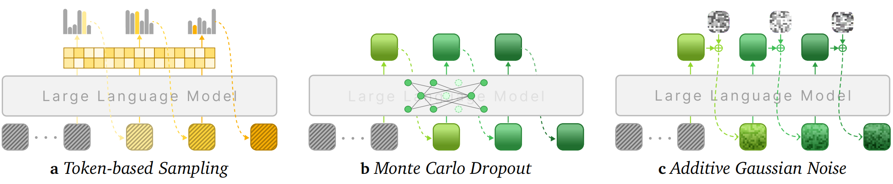

<a name="readme-top"></a>

<div align="center">

<h1>Parallel Test-Time Scaling for Latent Reasoning Models</h1>

</div>

<div align="center">

<!-- Paper Link -->

<a href="https://arxiv.org/abs/2510.07745">
    
  </a>

<!-- HuggingFace Models -->

<a href="https://huggingface.co/dd101bb/latentRM">
    
  </a>

<!-- HuggingFace Papers -->

<a href="https://huggingface.co/papers/2510.07745">
    
  </a>



</div>

---

This is the implementation for the paper [**Parallel Test-Time Scaling for Latent Reasoning Models**](https://huggingface.co/papers/2510.07745), enabling efficient exploration of continuous thought spaces through stochastic sampling and reward model-guided search. It provides implementations of two stochastic sampling methods (Monte Carlo Dropout and Additive Gaussian Noise) and a LatentRM for best-of-N and beam search strategies. This repository includes training scripts, evaluation pipelines, and inference code for multiple backbone models including COCONUT, CODI, and CoLaR, evaluated on benchmarks such as GSM8K Test, GSM8K Hard, and MultiArith.

### 🪐 Key Features

> [!IMPORTANT]
> **🧩 Full Transformers Integration**
> All models (COCONUT, CODI, and CoLaR) are **seamlessly integrated with Transformers**, providing native support for:
> - ✅ **Batch processing** for efficient parallel inference
> - ✅ **Standard Transformers APIs** (`generate()`, `from_pretrained()`, etc.)
> - ✅ **Device management** with `device_map` and multi-GPU support
> - ✅ **Easy integration** into existing Transformers-based workflows
> 
> Simply use `model.generate()` with batch inputs just like any other Transformers model!

🧭 **Stochastic Sampling Methods**
Two complementary approaches for exploring continuous thought spaces: Monte Carlo Dropout and Additive Gaussian Noise, enabling diverse reasoning path generation during inference.

🌌 **Latent Reward Model (LatentRM)**
A trained reward model that guides best-of-N selection and beam search, significantly improving reasoning accuracy by identifying high-quality latent reasoning paths.


## 📑 Table of Contents <span id="table-of-contents"></span>

* [🚀 Quick Start](#quick-start)
  * [Installation](#installation)
  * [Data](#data)
  * [Running](#running)
* [✨ How It Works](#how-it-works)
* [📁 Project Structure](#project-structure)
* [🤝 Community](#community)
* [🌱 Acknowledgements](#acknowledgements)
* [🔗 Related Projects](#related)
* [📚 Citation](#citation)

## 🚀 Quick Start <span id="quick-start"></span>


### 1. Installation <span id="installation"></span>

#### **Conda (recommended)**

```bash
conda create -n latenttts python=3.11 -y
conda activate latenttts
pip install -r requirements.txt
```


#### **Hardware Requirements**

* GPU: **Recommended for training and inference (CUDA-compatible)**
* Python: **3.11**
* CUDA: **Compatible with PyTorch 2.8.0**
* Frameworks: **PyTorch 2.8.0, Transformers 4.52.4, Accelerate 1.7.0**

### 2. Preparation <span id="data"></span>

#### **Dataset**

The datasets are located in the `/data` directory. These datasets are obtained from the [coconut](https://github.com/facebookresearch/coconut) project.

#### **Latent Reasoning Models**

Download the pre-trained models from HuggingFace to the `checkpoints/` directory:

```bash
# Download COCONUT model
huggingface-cli download dd101bb/latent-tts-coconut --local-dir checkpoints/coconut

# Download CODI model
huggingface-cli download dd101bb/latent-tts-codi --local-dir checkpoints/codi

# Download CoLaR model
huggingface-cli download dd101bb/latent-tts-colar --local-dir checkpoints/colar

# Optionally download LatentRM (for reward-guided generation)
huggingface-cli download dd101bb/latentRM --local-dir checkpoints/latentRM
```

**Simple Generation Example**

Here's a minimal example of using `.generate()` with a latent reasoning model:

```python
from transformers import AutoTokenizer
from src.generation_mixin import LatentGenerationMixin, LatentGenerationConfig
from src.paths import MODELS

# Load tokenizer
model_type = "coconut"  # or "codi", "colar"
model_id = MODELS[model_type]["id"]
tokenizer = AutoTokenizer.from_pretrained(model_id)
if tokenizer.pad_token is None:
    tokenizer.pad_token = tokenizer.eos_token

# Get latent token IDs
latent_id = tokenizer.convert_tokens_to_ids("<|latent|>")
start_id = tokenizer.convert_tokens_to_ids("<|start-latent|>")
end_id = tokenizer.convert_tokens_to_ids("<|end-latent|>")

# Create model class with generation mixin
class LatentModel(MODELS[model_type]["class"], LatentGenerationMixin):
    def __init__(self, config):
        super().__init__(config)

# Load model
model = LatentModel.from_pretrained(
    model_id,
    latent_id=latent_id,
    latent_start_id=start_id,
    latent_end_id=end_id,
    device_map="auto",
)

# Prepare input
question = "What is 2 + 2?\n<|start-latent|>"
inputs = tokenizer(question, return_tensors="pt").to(model.device)

# Configure generation
generation_config = LatentGenerationConfig(
    max_new_tokens=512,
    latent_length=6,
    latent_do_sample=True,
    latent_do_sample_by="dropout",  # or "noise"
    dropout_p=0.1,
    pad_token_id=tokenizer.pad_token_id,
    eos_token_id=tokenizer.eos_token_id,
)

# Generate
output = model.generate(
    **inputs,
    generation_config=generation_config,
    num_return_sequences=1,
)

# Decode result
result = tokenizer.decode(output[0], skip_special_tokens=True)
print(result)
```

#### **Data Annotation**

First, run the data annotation process to prepare training data for LatentRM:

```bash
./run_annotation.sh
```

This script will:

- Process training data and validation data with specified batch size and sampling parameters
- Generate annotated data for LatentRM training
- Save results to the specified output directory


### 3. Running <span id="running"></span>

#### **Training Configuration**

Configure your training parameters in the `training_args/` directory. The main configuration file is `train_coconut.yaml`:

```yaml
run_name: "run1"
metric_for_best_model: "test_n_64_recall_at_1"
output_dir: "/workspace/model-out/"
# ... other parameters
```

#### **Model Training**

Navigate to your project directory and launch training:

```bash
cd your/path/to/latent-tts
accelerate launch -m src.train training_args/train_coconut.yaml
```

The training process will:

- Load the annotated data from the previous step
- Train the latentRM with the specified configuration
- Save checkpoints and evaluation results

> [!NOTE]
> Pre-trained checkpoint for COCONUT is available at [HuggingFace](https://huggingface.co/dd101bb/latentRM).

#### **Evaluation and Testing**

##### **Majority Voting and Coverage Testing**

Run comprehensive evaluation using majority voting and coverage metrics:

```bash
# For LLaMA model (CoLaR)
./run_tests_llama.sh

# For GPT-2 models (COCONUT and CODI)
./run_tests.sh
```

These scripts will:

- Test different sampling strategies (dropout, noise)
- Evaluate on multiple datasets (GSM8K Test, MultiArith, GSM8K Hard)
- Generate detailed performance metrics including Pass@k, Coverage, and Voting Accuracy

##### **Beam Search and Best-of-N Testing**

For beam search evaluation:

```bash
./run_tts_with_rm.sh
```

This script will:

- Test beam search with different `beam size` (1, 2, 4, 8)
- Test Best-of-N with different `n_return_sequences` (1, 4, 16, 64)
- Generate logs for different configurations


<!--
How It Works (Methods Overview)


GOALS OF THIS SECTION:
1. Provide a clear and brief explanation of how the system or method works.
2. Make this understandable even for readers who do not yet know the technical details.

Points:
1. A high-level description of the system architecture or method.
2. Key components/modules and their roles.
3. A step-by-step workflow of the main process.
4. Figures or diagrams to illustrate the method.

Or:

you can organize in your own way as long as it meets the goals above!!!

-->

## ✨ How It Works <span id="how-it-works"></span>

🪐 **LatentTTS** is built around a modular research pipeline for **parallel test-time scaling of latent reasoning models**, where each component corresponds to a well-defined stage in the overall method.  
The system separates input processing, stochastic latent reasoning, and reward-guided selection into independent modules, allowing controlled experimentation and analysis.  
This design enables flexible replacement of individual components (e.g., switching between dropout and noise sampling, or different backbone models) without affecting the rest of the pipeline.

At a high level, the workflow proceeds as follows:

1. **Input Processing and Tokenization** — Raw problem inputs (e.g., math word problems) are tokenized and prepared with special latent tokens (`<|latent|>`, `<|start-latent|>`, `<|end-latent|>`). The model processes these inputs through its embedding layer, setting up the context for latent reasoning generation.  
2. **Stochastic Latent Reasoning Generation** — The model generates multiple diverse reasoning paths in the continuous latent space using one of two stochastic sampling methods: **Monte Carlo Dropout** (randomly dropping activations during forward passes to create variability) or **Additive Gaussian Noise** (injecting noise directly into latent embeddings). Each sampling method explores different regions of the latent thought space, producing varied reasoning trajectories for the same input.  
3. **Reward-Guided Selection and Output Generation** — The trained **Latent Reward Model (LatentRM)** evaluates the quality of each generated reasoning path by scoring latent embeddings. Based on these scores, the system applies either **best-of-N selection** (choosing the top-N highest-scoring paths) or **beam search** (maintaining multiple high-quality candidates during generation) to identify the most promising reasoning paths. The final answer is extracted from the selected path, significantly improving accuracy through parallel exploration and intelligent selection.


## 📁 Project Structure <span id="project-structure"></span>

```
latent-tts/
├── src/                   # Source code
│   ├── models/            # Model implementations
│   │   ├── coconut.py     # COCONUT model
│   │   ├── codi.py        # CODI model
│   │   ├── colar.py       # CoLaR model
│   │   ├── gpt2.py        # GPT-2 base models
│   │   ├── llama.py       # LLaMA base models
│   │   ├── loss.py        # Loss functions
│   │   └── perturbation.py # Perturbation methods
│   ├── annotate_data.py   # Data annotation script
│   ├── train.py           # latentRM training script
│   ├── trainer.py         # Training utilities
│   ├── infer_gpt2.py      # GPT-2 inference
│   ├── infer_llama.py     # LLaMA inference
│   ├── infer_gpt2_rm.py   # latentRM-based inference
│   ├── dataset.py         # Dataset handling
│   ├── generation_mixin.py # Generation utilities
│   ├── paths.py           # Path utilities
│   └── utils.py           # Utility functions
├── training_args/         # Training configurations
│   └── train_coconut.yaml # COCONUT training config
├── data/                  # Dataset files
├── checkpoints/           # Model checkpoints
│   └── latentRM/          # latentRM checkpoint
|   └── coconut/
├── run_annotation.sh      # Data annotation script
├── run_tests.sh           # GPT-2 evaluation script
├── run_tests_llama.sh     # LLaMA evaluation script
├── run_tts_with_rm.sh     # Beam search evaluation script
└── requirements.txt       # Python dependencies
```

## 🤝 Join the Community <span id="community"></span>

We welcome researchers, developers, and enthusiasts to join the **LatentTTS** community. You can participate by reporting issues, contributing features, or sharing feedback to help us improve and grow the project.

> [!TIP]
> 📄 Explore the paper on [**Hugging Face Papers**](https://huggingface.co/papers/2510.07745) — it includes community discussions, citation tools, and related resources. If you find our work insightful, please consider giving it an **upvote** to support further research!

## 🌱 **Acknowledgements** <span id="acknowledgements"></span>

We would like to thank the contributors, open-source projects, and research communities whose work made **LatentTTS** possible. This project builds upon ideas, tools, and datasets developed by the broader machine learning and reasoning research ecosystem. We also acknowledge helpful discussions and support from the members of **Modality Dance Group** and the open-source community.

This project is licensed under the **MIT License**. Please refer to the LICENSE file for more details.


## 🔗 **Related Projects** <span id="related"></span>

### 📄 Related Papers

- **[LLMs are Single-threaded Reasoners: Demystifying the Working Mechanism of Soft Thinking](https://arxiv.org/abs/2508.03440)**  
  Check out stochastic soft thinking!

### 🌟 Awesome Collections

- **[Awesome Latent Space](https://github.com/YU-deep/Awesome-Latent-Space)**  
  A curated collection of resources on latent space methods and applications.

- **[Awesome Latent CoT](https://github.com/EIT-NLP/Awesome-Latent-CoT)**  
  A comprehensive list of latent chain-of-thought reasoning resources.

- **[Awesome Efficient Reasoning](https://github.com/hemingkx/Awesome-Efficient-Reasoning)**  
  A collection of efficient reasoning methods and techniques.


## 📚 **Citation** <span id="citation"></span>

If you use **LatentTTS** in your research or applications, please consider citing:

```bibtex
@misc{you2025paralleltesttimescalinglatent,
      title={Parallel Test-Time Scaling for Latent Reasoning Models}, 
      author={Runyang You and Yongqi Li and Meng Liu and Wenjie Wang and Liqiang Nie and Wenjie Li},
      year={2025},
      eprint={2510.07745},
      archivePrefix={arXiv},
      primaryClass={cs.CL},
      url={https://arxiv.org/abs/2510.07745}, 
}
```

---

<div align="center">

<a href="https://github.com/ModalityDance/LatentTTS">
  
</a>

<a href="https://github.com/ModalityDance/LatentTTS/issues">
  
</a>


</div>