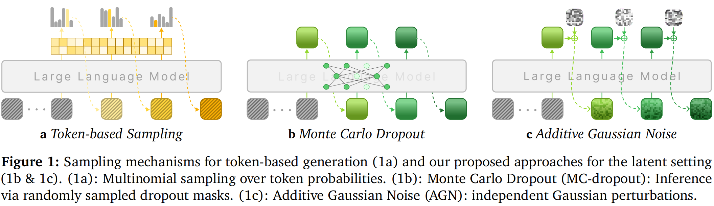

<a name="readme-top"></a>

<div align="center">
  <h1 align="center">LatentTTS: Parallel Test-Time Scaling for Latent Reasoning Models</h1>
</div>

<div align="center">

<!-- Paper Link -->

<a href="https://arxiv.org/abs/2510.07745">
    
  </a>

<!-- HuggingFace Models -->

<a href="https://huggingface.co/dd101bb/latentRM">
    
  </a>

<!-- HuggingFace Papers -->

<a href="https://huggingface.co/papers/2510.07745">
    
  </a>



</div>

Welcome to **LatentTTS**! 👋 LatentTTS is a framework for parallel test-time scaling of latent reasoning models, enabling efficient exploration of continuous thought spaces through stochastic sampling and reward model-guided search. It provides implementations of two stochastic sampling methods (Monte Carlo Dropout and Additive Gaussian Noise) and a LatentRM for best-of-$N$ and beam search strategies. This repository includes training scripts, evaluation pipelines, and inference code for multiple backbone models including COCONUT, CODI, and CoLaR, evaluated on benchmarks such as GSM8K Test, GSM8K Hard, and MultiArith.

### 🪐 Key Features

🧭 **Stochastic Sampling Methods**
Two complementary approaches for exploring continuous thought spaces: Monte Carlo Dropout and Additive Gaussian Noise, enabling diverse reasoning path generation during inference.

🌌 **Latent Reward Model (LatentRM)**
A trained reward model that guides best-of-$N$ selection and beam search, significantly improving reasoning accuracy by identifying high-quality latent reasoning paths.

🧩 **Multi-Backbone Support**
Comprehensive support for COCONUT, CODI, and CoLaR frameworks, making it easy to apply test-time scaling techniques across different latent reasoning architectures.

🔬 **Comprehensive Evaluation**
Built-in evaluation pipelines for multiple benchmarks (GSM8K Test, GSM8K Hard, MultiArith) with metrics including Pass@k, Coverage, and Voting Accuracy.


## 📑 Table of Contents <span id="table-of-contents"></span>

* [🚀 Quick Start](#quick-start)
  * [Installation](#installation)
  * [Data](#data)
  * [Running](#running)
* [📁 Project Structure](#project-structure)
* [🤝 Community](#community)
* [🌱 Acknowledgements](#acknowledgements)
* [🔗 Related Projects](#related)
* [📚 Citation](#citation)

## 🚀 Quick Start <span id="quick-start"></span>


### 1. Installation <span id="installation"></span>

#### **Conda (recommended)**

```bash
conda create -n latenttts python=3.11 -y
conda activate latenttts
pip install -r requirements.txt
```


#### **Hardware Requirements**

* GPU: **Recommended for training and inference (CUDA-compatible)**
* Python: **3.11**
* CUDA: **Compatible with PyTorch 2.8.0**
* Frameworks: **PyTorch 2.8.0, Transformers 4.52.4, Accelerate 1.7.0**

### 2. Data Preparation <span id="data"></span>

#### **Data Annotation**

First, run the data annotation process to prepare training data for LatentRM:

```bash
./run_annotation.sh
```

This script will:

- Process training data and validation data with specified batch size and sampling parameters
- Generate annotated data for LatentRM training
- Save results to the specified output directory


### 3. Running <span id="running"></span>

#### **Training Configuration**

Configure your training parameters in the `training_args/` directory. The main configuration file is `train_coconut.yaml`:

```yaml
run_name: "run1"
metric_for_best_model: "test_n_64_recall_at_1"
output_dir: "/workspace/model-out/"
# ... other parameters
```

#### **Model Training**

Navigate to your project directory and launch training:

```bash
cd your/path/to/latent-tts
accelerate launch -m src.train training_args/train_coconut.yaml
```

The training process will:

- Load the annotated data from the previous step
- Train the latentRM with the specified configuration
- Save checkpoints and evaluation results

> [!NOTE]
> Pre-trained checkpoint for COCONUT is available at [HuggingFace](https://huggingface.co/dd101bb/latentRM).

#### **Evaluation and Testing**

##### **Majority Voting and Coverage Testing**

Run comprehensive evaluation using majority voting and coverage metrics:

```bash
# For LLaMA model (CoLaR)
./run_tests_llama.sh

# For GPT-2 models (COCONUT and CODI)
./run_tests.sh
```

These scripts will:

- Test different sampling strategies (dropout, noise)
- Evaluate on multiple datasets (GSM8K Test, MultiArith, GSM8K Hard)
- Generate detailed performance metrics including Pass@k, Coverage, and Voting Accuracy

##### **Beam Search and Best-of-N Testing**

For beam search evaluation:

```bash
./run_tts_with_rm.sh
```

This script will:

- Test beam search with different `beam size` (1, 2, 4, 8)
- Test Best-of-N with different `n_return_sequences` (1, 4, 16, 64)
- Generate logs for different configurations


## 📁 Project Structure <span id="project-structure"></span>

```
latent-tts/
├── src/                   # Source code
│   ├── models/            # Model implementations
│   │   ├── coconut.py     # COCONUT model
│   │   ├── codi.py        # CODI model
│   │   ├── colar.py       # CoLaR model
│   │   ├── gpt2.py        # GPT-2 base models
│   │   ├── llama.py       # LLaMA base models
│   │   ├── loss.py        # Loss functions
│   │   └── perturbation.py # Perturbation methods
│   ├── annotate_data.py   # Data annotation script
│   ├── train.py           # latentRM training script
│   ├── trainer.py         # Training utilities
│   ├── infer_gpt2.py      # GPT-2 inference
│   ├── infer_llama.py     # LLaMA inference
│   ├── infer_gpt2_rm.py   # latentRM-based inference
│   ├── dataset.py         # Dataset handling
│   ├── generation_mixin.py # Generation utilities
│   ├── paths.py           # Path utilities
│   └── utils.py           # Utility functions
├── training_args/         # Training configurations
│   └── train_coconut.yaml # COCONUT training config
├── data/                  # Dataset files
├── checkpoints/           # Model checkpoints
│   └── latentRM/          # latentRM checkpoint
├── run_annotation.sh      # Data annotation script
├── run_tests.sh           # GPT-2 evaluation script
├── run_tests_llama.sh     # LLaMA evaluation script
├── run_tts_with_rm.sh     # Beam search evaluation script
└── requirements.txt       # Python dependencies
```

## 🤝 Join the Community <span id="community"></span>

We welcome researchers, developers, and enthusiasts to join the **LatentTTS** community. You can participate by reporting issues, contributing features, or sharing feedback to help us improve and grow the project.

> [!TIP]
> 📄 Explore the paper on [**Hugging Face Papers**](https://huggingface.co/papers/2510.07745) — it includes community discussions, citation tools, and related resources. If you find our work insightful, please consider giving it an **upvote** to support further research!

## 🌱 **Acknowledgements** <span id="acknowledgements"></span>

We would like to thank the contributors, open-source projects, and research communities whose work made **LatentTTS** possible. This project builds upon ideas, tools, and datasets developed by the broader machine learning and reasoning research ecosystem. We also acknowledge helpful discussions and support from the members of **Modality Dance Group** and the open-source community.

This project is licensed under the **MIT License**. Please refer to the LICENSE file for more details.


## 🔗 **Related Projects** <span id="related"></span>

### 📄 Related Papers

- **[LLMs are Single-threaded Reasoners: Demystifying the Working Mechanism of Soft Thinking](https://arxiv.org/abs/2508.03440)**  
  Check out stochastic soft thinking!

### 🌟 Awesome Collections

- **[Awesome Latent Space](https://github.com/YU-deep/Awesome-Latent-Space)**  
  A curated collection of resources on latent space methods and applications.

- **[Awesome Latent CoT](https://github.com/EIT-NLP/Awesome-Latent-CoT)**  
  A comprehensive list of latent chain-of-thought reasoning resources.

- **[Awesome Efficient Reasoning](https://github.com/hemingkx/Awesome-Efficient-Reasoning)**  
  A collection of efficient reasoning methods and techniques.


## 📚 **Citation** <span id="citation"></span>

If you use **LatentTTS** in your research or applications, please consider citing:

```bibtex
@misc{you2025paralleltesttimescalinglatent,
      title={Parallel Test-Time Scaling for Latent Reasoning Models}, 
      author={Runyang You and Yongqi Li and Meng Liu and Wenjie Wang and Liqiang Nie and Wenjie Li},
      year={2025},
      eprint={2510.07745},
      archivePrefix={arXiv},
      primaryClass={cs.CL},
      url={https://arxiv.org/abs/2510.07745}, 
}
```